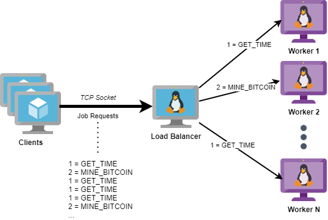

# Setup
## Create VM with Hyper-V
(if you don't already have one)
1. Start menu: Turn windows features on or off  

2. Enable Hyper-V  

3. Restart computer
4. Open Hyper-V Manager  

5. Quick create on right menu  

6. Choose Ubuntu 20.04 image and click Crate Virtual Machine
7. Wait for image to download :)
8. Edit settings and configure with 8GB (8192MB) of RAM  

9. Start VM and configure Ubuntu settings - WRITE DOWN USER+PASS!

## Prepare Env
Install deps:
```bash
sudo apt update --fix-missing
sudo apt update
sudo apt install -y ca-certificates git wget curl vim linux-tools-$(uname -r) linux-tools-generic
```

Install Python packages:
```bash
pip3 install dill loguru psutil scapy
```

Finally, clone our repo:
```bash
git clone https://github.com/dolevelbaz/odysseyhpc.git
```

# Exercise 1
## Stages
1. Implement packet processing logic using scapy for a single core - fill in code for TODOs in `src/main.py`. See [scapy.md](docs/scapy.md).
    ```python
    # pcap only
    python3 main.py --pcap ../pcaps/small.pcap
    # with client/server
    python3 main.py --pcap ../pcaps/small.pcap --client 184.85.226.161:443 --server 172.16.255.1:10646
    ```
2. Benchmark performance with [perf](docs/perf.md).
3. Modify the program so it can run on multiple cores using `multiprocess` module. See [multiprocess.md](docs/multiprocess.md). You should now run it with the `--multi` flag. First implement without client/server support.
4. Optimize and continue benchmarking.
5. Implement a distributed version: a master machine that splits the work between multiple worker machines that do the processing.


## Input Files
To test your code, you'll need some `pcap` files. Download them with `curl` (run this when shell is in the repo's dir).
```bash
# small example - to get things working
curl https://s3.amazonaws.com/tcpreplay-pcap-files/smallFlows.pcap --output pcaps/small.pcap
# large example - to test performance
curl https://s3.amazonaws.com/tcpreplay-pcap-files/bigFlows.pcap --output pcaps/big.pcap
```

## Expected Results
Small:
* 14261 packets
* 13708 IPv4 TCP packets
* 121 packets for connection 184.85.226.161:443<->172.16.255.1:10646 (both directions)

Big: let me know what you got :)

# Exercise 2
Now that you know how to run a distributed multi-process app and measure its performance with `perf`, you'll implement a simple load balancer (LB).

There are two types of jobs:
1. `GET_TIME` - get the current time in seconds
2. `MINE_BITCOIN` - calculate the `sha256` hash of the current time in seconds for 256 times, i.e. calculate `sha256(sha256(sha256...sha256(current_time)))` [NOTE: of course this is does not really mine Bitcoin, but for this exercise it's close enough.]

The following scheme illustrates the flow:



The LB waits for client job requests arriving on a TCP socket. Each packet represents one job request and its payload contains the job's number. For example, a packet with payload=1 is a `GET_TIME` job request. The LB chooses a worker to run the job and waits for the result, then sending it back to the client.

Note that different workers might have different hardware specifications, thus your LB should take that into account when choosing the worker to execute the job.

For your convenience, a [test client](src/client.py) is available. An example for running it:
```bash
# from command line
python3 client.py --lb 127.0.0.1:13337 --jobs 1,2,1,1,1,2
# from a file
echo 1,2,1,1,1,2 > jobs.txt
python3 client.py --lb 127.0.0.1:13337 --f jobs.txt
```

Before you begin coding, take some time to think about the architecture of your solution. How is data passed to/from worker? Which worker should run each job? How are you going to test it?

This exercise will be done in teams of 3, meaning you have 3 VMs for each team.
One VM will run the LB (and test client), while the two other VMs will run workers.
In order to determine who the best team is, you'll measure the performance of your LB with `perf`.

Good luck!
