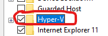
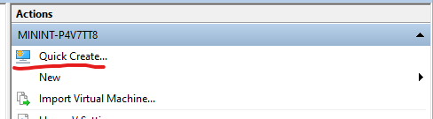
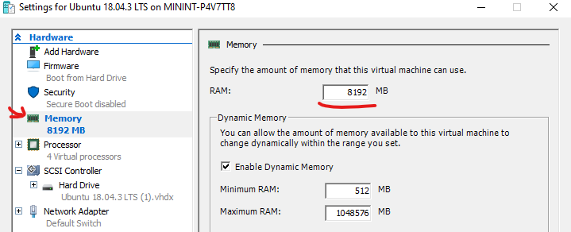

# Setup
## Create VM with Hyper-V
(if you don't already have one)
1. Start menu: Turn windows features on or off  

2. Enable Hyper-V  

3. Restart computer
4. Open Hyper-V Manager  

5. Quick create on right menu  

6. Choose Ubuntu 20.04 image and click Crate Virtual Machine
7. Wait for image to download :)
8. Edit settings and configure with 8GB (8192MB) of RAM  

9. Start VM and configure Ubuntu settings - WRITE DOWN USER+PASS!

## Prepare Env
Install deps:
```bash
sudo apt update --fix-missing
sudo apt update
sudo apt install -y ca-certificates git wget curl vim linux-tools-$(uname -r) linux-tools-generic
```

Install Python packages:
```bash
pip3 install dill loguru psutil scapy
```

Finally, clone our repo:
```bash
git clone https://github.com/dolevelbaz/odyssey2021.git
```

# Exercise
## Stages
1. Implement packet processing logic using scapy for a single core - fill in code for TODOs in `src/main.py`. See [scapy.md](docs/scapy.md).
    ```python
    # pcap only
    python3 main.py --pcap ../pcaps/small.pcap
    # with client/server
    python3 main.py --pcap ../pcaps/small.pcap --client 184.85.226.161:443 --server 172.16.255.1:10646
    ```
2. Benchmark performance with [perf](docs/perf.md).
3. Modify the program so it can run on multiple cores using `multiprocess` module. See [multiprocess.md](docs/multiprocess.md). You should now run it with the `--multi` flag. First implement without client/server support.
4. Optimize and continue benchmarking.


## Input Files
To test your code, you'll need some `pcap` files. Download them with `curl` (run this when shell is in the repo's dir).
```bash
# small example - to get things working
curl https://s3.amazonaws.com/tcpreplay-pcap-files/smallFlows.pcap --output pcaps/small.pcap
# large example - to test performance
curl https://s3.amazonaws.com/tcpreplay-pcap-files/bigFlows.pcap --output pcaps/big.pcap
```

## Expected Results
Small:
* 14261 packets
* 13708 IPv4 TCP packets
* 121 packets for connection 184.85.226.161:443->172.16.255.1:10646

Big: let me know what you got :)
